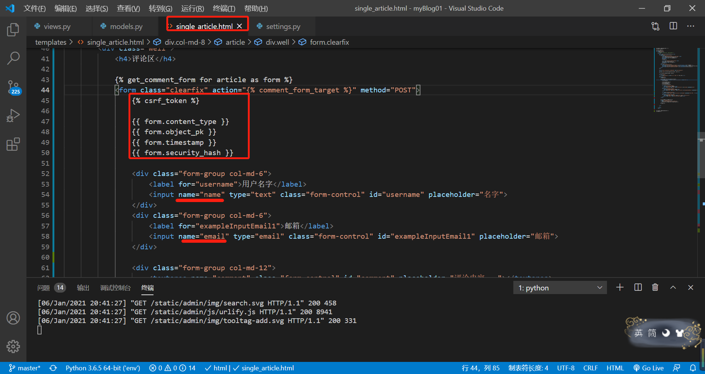

### 一.软件的安装

---

1. VSCode下载（安装python，chinese，path intellisence，npm，npm intellisence，Vetur，VUE3 Snipper，vscode-icons，live-server）

2. 配置终端

   切换到cmd

3. 安装前端开发工具HbuilderX   https://www.dcloud.io/hbuilderx.html

4. 安装小程序开发工具   https://developers.weixin.qq.com/miniprogram/dev/devtools/download.html

### 二.git仓库:  https://git-scm.com/；

---

1. 安装git

2. 创建远程仓库myBlog

3. 初始化本地仓库,也就是再本地的myBlog文件夹下执行:`git init`,执行后会创建一个.git隐藏文件

   

4. 远程仓库和本地仓库进行关联:`git remote add origin '你的远程仓库地址'`

5. 如果出现错误,ssh没有创建

6. 先去创建密钥:`ssh keygen`, 一路enter,生成密钥

7. 查看生成的密钥 `cat~/.ssh/id_rsa.pub`,将生成的密钥写入github上的settings下的SSH and GPG keys下。

8. 推送四步骤

- git status     查看发生变化的文件
- git add .     追踪所有发生变化的文件
- git commit -m '备注'  提交到本地仓库
- git push -u origin master 首次提交到远程仓库
- git push  之后的提交

9. 克隆 ：git clone https://github.com/ITClubOfBruce/myBlog.git 

   

### 三.创建myBlog项目

---

1. 空文件夹下,执行`django-admin startproject myBlog `

2. 给myBlog创建虚拟环境,使用:`python -m venv env `

3. 进入虚拟环境,windows:`.\\env\\Scripts\\activate`

4. 退出虚拟环境,windows下:`deactivate`

5. 使用VScode打开myBlog,执行:`python manage.py startapp article `  

   - 创建的所有app记得在settings里面注册一下。

6. 创建超级管理员账户: `python manage.py createsuperuser`

   

### 四.创建articles的models

---

- pip install pillow 处理图片需要的库
- '进行迁移'：
   - python manage.py makemigrations
   - python manage.py migrate

#### 1. 创建model

- 注册进admin.py中

- apps.py中可更改一些页面的展示，以及主url中修改的

  

#### 2. 数据库同步

'进行迁移'：
 - python manage.py makemigrations
 - python manage.py migrate

#### 3. 再次推送到远程

- git status查看发生变化的文件
- git add .追踪所有发生变化的文件
- git commit -m '备注'′提交到本地仓库
- git push -u origin master首次提交到远程仓库
- git push 之后的提交

### 五、业务逻辑（前端分析)

---

1. 文章列表页，分页
2. 文章详情页，评论
3. 全局搜索功能 ，用Q对象
4. 最新文章，最新评论的排行
5. 按照分类，标签的一个聚类操作
6. 练习我页面，发送邮件

### 六、添加静态页面，以及配置

---

#### 	1.创建static、templates两个空文件夹

#### 	2.在settings.py中配置路径

#### 	3.将提前准备好的前端页面和文件分别放进static和templates文件夹中

- 分析一下页面

  渲染列表，可以点击详情页，

  通篇都有搜索功能，首页订阅是rss功能

  

​	

#### 	4.view

#### 5. 创建一个分urls，总路由进行分发，

#### 6. 继承静态资源，把static的样式  继承到 模板，每个页面都要改成这样

#### 7. 使用django自带DTL语言实现模板继承（重复的内容只在一个文件中存在），模板嵌套

- 我们经常说Django是MTV的设计模型，M：models数据相关的，T：templates模板相关的，V：views视图从数据库取出数据渲染到模板上的桥梁。

  

#### 8.渲染模板

​	（1.）渲染列表页

​		（2.）渲染详情页

- 实现跳转的三种方式

- 1.通过url标签：`
<a href="">阅读全文...</a>
`

- 2.拼接字符串：`
<a href="/detail/{{ article.id }}">阅读全文...</a>
`

- 3.通过get_absolute_url( )函数:`
<a href="{{ article.get_absolute_url }}">阅读全文...</a>
`

  

### 七、将所有app归拢到apps文件夹下

import sys

sys.path.insert(0,os.path.join(BASE_DIR,"apps"))

### 八、创建第二个model

注册进admin中

标签，分页

访问量

访问量+1

点击标题进入详情页，用反向解析

最新文章，本身是倒序，列表页和详情页有

标签云

### 

### 九、分页

官网文档

报错原因：因为是在python环境中，不是django环境

官网中在视图中如何使用分页

### 十、搜索

### 十一、使用第三方插件markdownx

- 评论和集成markdownfy插件

> 1. 在全局路径中添加路由`path('markdownx/', include('markdownx.urls')),`
>
> 2. settings.py中注册`STATIC_ROOT = os.path.join(BASE_DIR,'static')`
>
> 3. 终端中执行`python manage.py collectstatic` ,输入yes，执行完成后在satic文件夹下面就会生成两个东西，一是admin文件夹是后端管理后台的所有样式，二是markdownx文件夹放着markdownx插件的静态资源。
>
> 
>
> 4. 将settings.py文件中注册的``STATIC_ROOT`注释掉，将上面的`STATICFILES_DIRS`打开，
>
> 
>
> 5. - 在models中的用法：
>
> 引入`from markdownx.models import MarkdownxField`
>
> 
>
>    - 在form表单中的用法
>
>    - 在django admin中的用法：
>
>   引入`from markdownx.widgets import AdminMarkdownxWidget`,`from django.db import models`
>
>   
>
> 用markdownx插件渲染在前端展示在页面中的办法：
>
> 
>
> 
>
> 
>
> 在settings.py设置自建的templates中渲染模板
>
> 
>
> 在templates下面创建文件夹markdownx,再创建文件wedget.html, 
>
> 

### 十二、使用第三方插件comments,

------

> 1. 安装`pip install django-contrib-comments`
>
> 2. 在settings中的app下添加`django.contrib.sites`,和SITE_ID.
>
>    
>
> 3. 再settings下的app下添加`django_comments`
>
> 4. 同步到数据库`python manage.py migrate`
>
> 5. 在总路由中添加` path('comments/',include('django_comments.urls')),`
>
> 6. 在详情页中先解析
>
>    
>
> 7. 在详情页中先加载``
>
>    
>
>    
>
>    
>
> 8. 将评论展示出来
>
>    

### rss订阅

